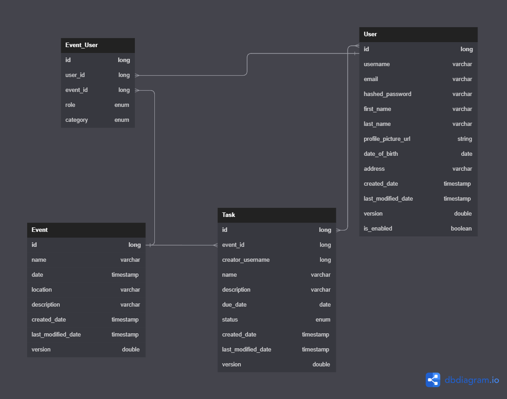

# Java-Web-Project-Backend

Проектът за управление на събития е уеб приложение, което потребителите да управляват своите събития и статуса на задачите им. Системата позволява на потребителите да организират и следят събития, да назначават задачи на потребителите, които планират събитието и да следят статуса на задачите.

## Архитектура и дизайн на проекта
### Архитектурен шаблон и разпределение
Проектът е изграден, използвайки MVC(Model-View-Controller) архитектурния шаблон, който представлява разделяне на приложението в три основни компонента:
- `model` - класове и функционалност, които използваме при работа с базата
- `controller` - класове, които съдържат основната бизнес логика и служат за връзка между класове, свързани с "Потребителския интерфейс" и тези свързани с базата.
- `view` -  класове и функционалност, съдържащи цялата логика за "Потребителския интерфейс".

Разделението на проекта на смислови части е следното:
- клиентска част: където влизат всички основни и помощни класове, свързани с изграждането на 'Потребителския интерфейс'
- сървърна част: влизат всички основни и помощни класове, свързани с работата на сървъра и тези нужни за работа с базата.


### Дизайн
Проекта съдържа няколко различни изгледа за работа с него, като всеки един от тях е логически свързан с останалите. Основните визуални интерфейси, който за момента за имплементирани са:
- `табло за задачите:` - поддържащо всички възможни функционалностти, свързани със задачите

- `табло за събитията:` - поддържащо основни операции свързани със събитията

- `табло за потребителски профил:` - поддържащо информация за потребителя, с възможност за коригиране

- `форма за регистрация, влизане в приложението и промяна на парола: ` - поддържащо фунцкионалност за регистриране, влизане и промяна на парола

## E/R диаграма



### Класове, свързани с базата

#### User

- описва потребителя в системата

#### Event_User

- описва ролите на потребителя спрямо събитието, в което участва

#### Event

- описва данните за събитията

#### Task

- описва данните за задачите към съответните събития

### Връзки

- `между "Event" и "Task"` - описва приндадлежнстта на задачата към определеното събитие

- `между "Event" и "Event_User"` - задава валидни събития, към които могат да участват съответните потребители

- `между "Task" и "User"` - описва възможността да се назначат потребители към съответната задача (Many-to-many relationship)

- `между "User" и "Event_User"` - задава валидни потребители, които да се асоциират с определена роля към определено събитие


## Работа с проекта

### Tech stack

- `Angular`
- `PostgreSQL`
- `Spring Boot`
- `Docker`
- `Swagger`


### Изисквания

За да стартирате това приложение, ви е необходимо:

- JDK
- Node.js инсталиран на вашия компютър. Можете да изтеглите и инсталирате Node.js от [официалния уебсайт](https://nodejs.org).
- Docker инсталиран на вашия компютър. Можете да изтеглите и инсталирате Docker от [официалния уебсайт](https://www.docker.com).


## Инсталация

1. Клонирайте хранилищата на локалния ви компютър:

   ```shell
   git clone https://github.com/nabrasheva/Java-Web-Project-Frontend.git
   
   git clone https://github.com/nabrasheva/Java-Web-Project-Backend.git
   ```

2. Отидете в директорията на проекта:
    
    - за back-end:
   ```shell
   cd project
   ```
   
   - за front-end:
   ```shell
   cd event-planning-app
   ```

3. Инсталирайте зависимостите на проекта:
    
    - за front-end:
   ```shell
   npm install
   ```
    
    - за Docker - отидете в директорията "project/src/main/docker" и чрез командата 
   ```shell
   docker compose up
   ```
   При проблеми с credentials, те могат да бъдат променени в "docker-compose.yml" и в "applications-dev.yml"


## Стартиране на приложенията

За да стартирате "front-end" приложението, отидете в директорията на проекта и стартирайте командата:

```shell
ng serve
```

За да стартирате "back-end" приложението, отидете във файла "com/fmi/project/ProjectApplication.java" на проекта и стартирайте приложението:

По този начин ще стартирате сървъра на приложението и ще можете да започнете работа с него. 

След като стартирате успешно приложението, можете да отидете на адрес: http://localhost:8079/swagger-ui/index.html#/ , където да се отвори "Swagger".